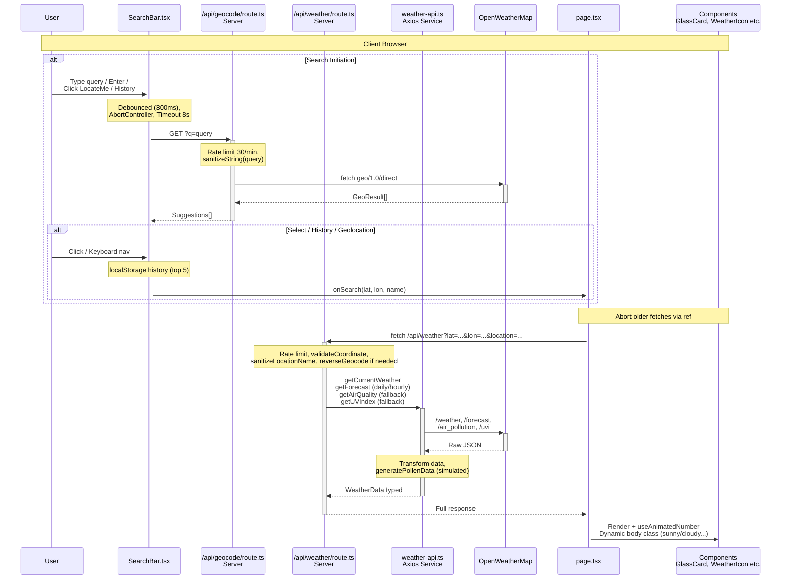

# Weather App Architecture Flow

## Overview

A modern Next.js 14+ weather application using App Router, TypeScript, Tailwind CSS with glassmorphism design. Features current weather, hourly/5-day forecast, air quality, UV index, pollen (simulated), geolocation search, themes, unit toggle.

**Key Features:**
- Proxy API routes to OpenWeatherMap (security, rate limiting)
- Client-side animations (useAnimatedNumber)
- Responsive glass cards
- LocalStorage for unit, location, search history
- Dynamic backgrounds based on weather condition

**Tech Stack:**
```
Frontend: Next.js App Router, React 18+, TypeScript, Tailwind CSS, react-icons
API: OpenWeatherMap (current, 5-day forecast, air pollution, UV)
State: React useState/useEffect, localStorage
Security: Rate limiting (30/min/IP), input sanitization
Testing: Jest (__tests__/)
Build: ESLint, PostCSS
```

## Component Hierarchy

```mermaid
graph TB
    Layout[RootLayout<br/>src/app/layout.tsx<br/>Server Component]
    Page[HomePage<br/>src/app/page.tsx<br/>'use client']
    
    Layout --> Page
    
    subgraph "Page Direct Children"
        Header[Header *(inline in [`src/app/page.tsx`](src/app/page.tsx:132))*<br/>Title + UnitToggle]
        SB[SearchBar<br/>Geocoding + History + LocateMe]
        Error[Error GlassCard *(inline in [`src/app/page.tsx`](src/app/page.tsx:152))*]
        Current[GlassCard Current Weather *(inline in [`src/app/page.tsx`](src/app/page.tsx:164))*<br/>Large responsive grid]
        Hourly[HourlyForecast<br/>data={hourly}]
        Forecast[GlassCard 5-Day Forecast<br/>Grid of daily cards]
        Loading[Loading Skeleton GlassCards *(inline in [`src/app/page.tsx`](src/app/page.tsx:398))*]
        Theme[ThemeToggle<br/>absolute positioned]
    end
    
    Page --> Header
    Page --> SB
    Page --> Error
    Page --> Current
    Page --> Hourly
    Page --> Forecast
    Page --> Loading
    Page --> Theme
    
    subgraph "CurrentWeather Sub-elements"
        WI[WeatherIcon<br/>condition + icon]
        Stats[Stats Grid 2x2<br/>FeelsLike, Humidity,<br/>Wind km/h, Pressure]
        AQ[Air Quality StatCard<br/>AQI + pollutant]
        UV[UV Index StatCard<br/>Index + risk]
        Pollen[Pollen StatCard<br/>Total + risk]
    end
    
    Current --> WI
    Current --> Stats
    Current --> AQ
    Current --> UV
    Current --> Pollen
    
    style Layout fill:#e1f5fe
    style Page fill:#f3e5f5
    classDef glass fill:#e3f2fd
```

## Data Flow



## Key Implementation Details

### Security & Resilience
- **Rate Limiting**: Up to 30 req/min per IP (sliding window)
- **Input Sanitization**: validateCoordinate (-90..90 lat, -180..180 lon), sanitizeString/remove tags
- **Timeouts**: Axios 10s, fetch 8s, geolocation 10s
- **Fallbacks**: Optional APIs (air/uv/pollen) return defaults on fail
- **Abort**: AbortController for concurrent fetches

### Data Processing
- **Forecast**: 5-day/3h -> first 8 hourly, aggregate daily (noon rep)
- **Pollen**: Algorithm based on temp/humidity/wind averages
- **Types**: Strict interfaces in [`src/lib/types.ts`](src/lib/types.ts)

### UI/UX
- **Glassmorphism**: GlassCard variants (primary/tertiary), backdrop-filter blur
- **Animations**: CSS keyframes (fade-scale, slide-up), no heavy libs
- **Responsive**: Tailwind sm/md/lg breakpoints
- **Accessibility**: aria-labels, role=combobox, keyboard nav

### Custom Hooks

- **useWeather.ts** [`src/hooks/useWeather.ts`](src/hooks/useWeather.ts): Client-side hook mirroring server API logic with `fetchWithFallback` for optional data resilience (current, forecast, air quality, UV index, generated pollen).

  **Status**: Currently **unused**. [`src/app/page.tsx`](src/app/page.tsx) duplicates the logic inline via `handleSearch()` function (lines 43-70).

  **Recommendations**:
  - Refactor `page.tsx` to use the hook: `const { fetchWeather, searchLocation } = useWeather();` – eliminates duplication, improves maintainability and testability.
  - Enables reuse in future components/pages.
  - Integrate caching (React Query or SWR) through the hook for better performance.
## Potential Improvements
- Real pollen API integration
- More forecast days/details
- PWA/offline support
- Error boundaries
