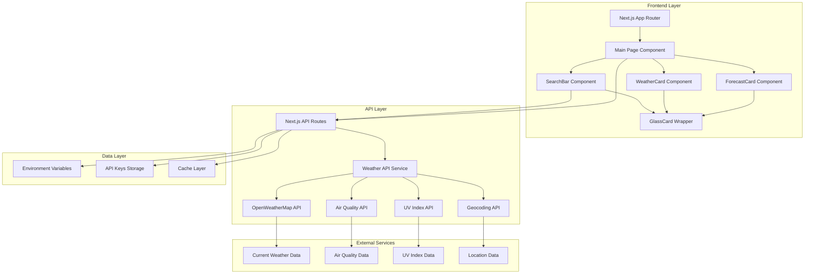
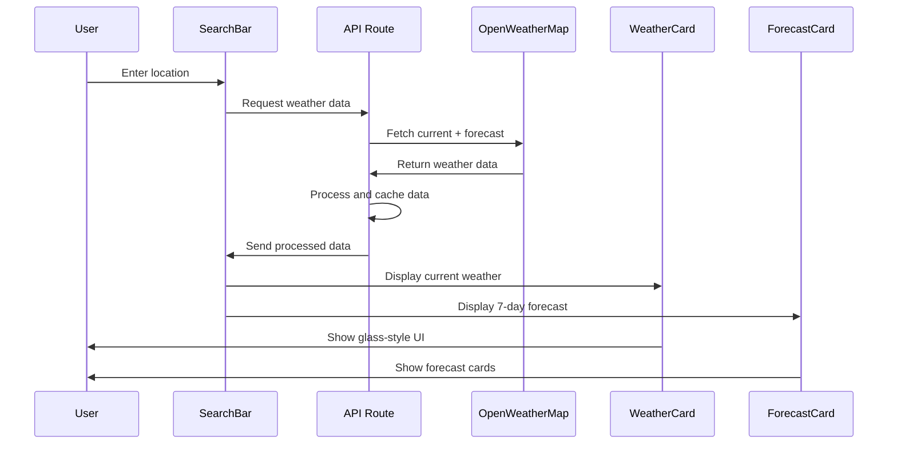
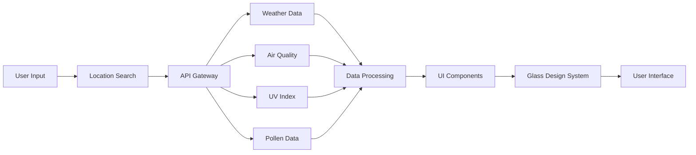
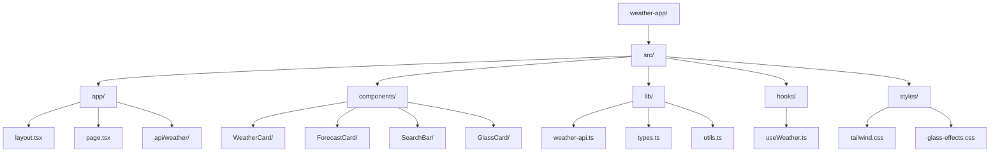
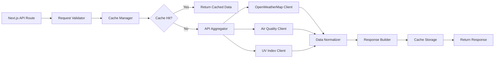
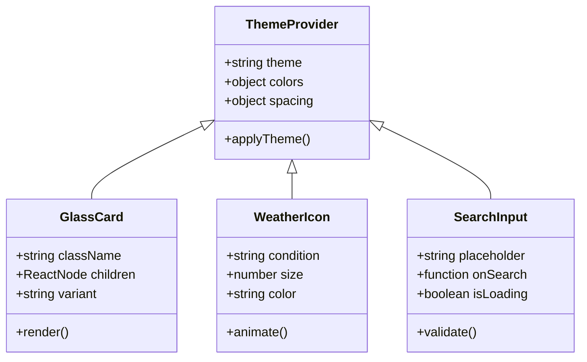

# Weather App Architecture Diagram

## System Architecture Overview

## Component Interaction Flow

## Data Flow Architecture

## File Structure Visualization

## API Integration Architecture

## Glass Design System

This architecture provides a scalable, maintainable structure for the weather application with clear separation of concerns and efficient data flow management.